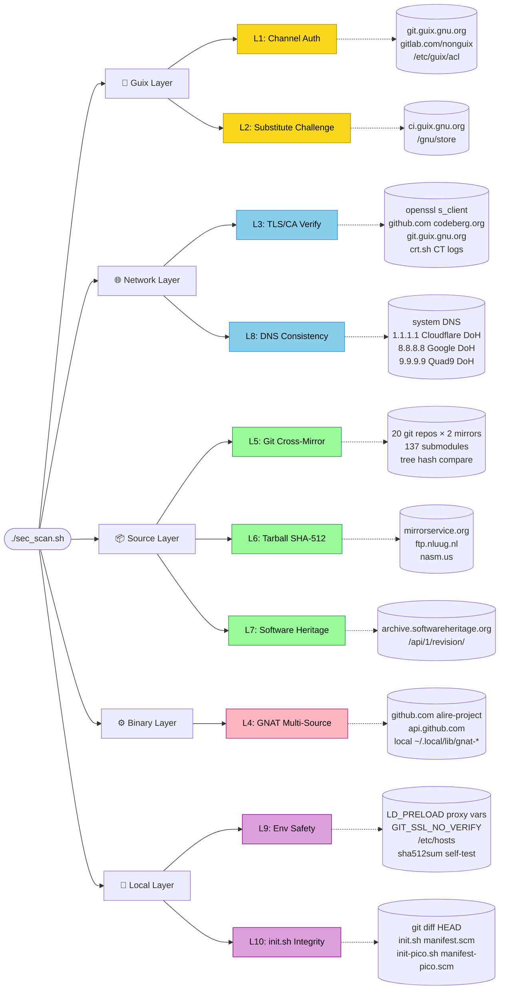
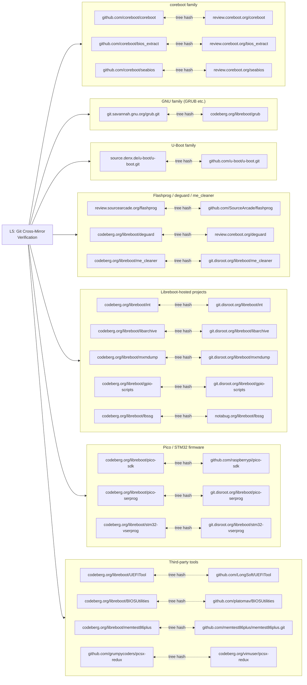
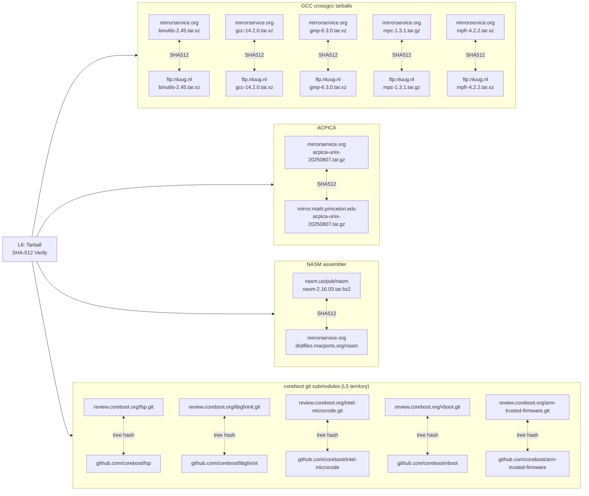
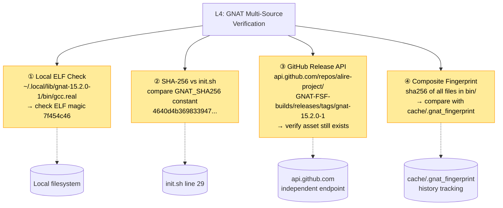

# sec_scan.sh -- คู่มือตรวจสอบ Supply-Chain Integrity

## ทำไมต้องมีสคริปต์นี้

lbmk (Libreboot build system) ต้องดาวน์โหลดซอฟต์แวร์จากหลายแหล่ง
ก่อนที่จะ build ออกมาเป็น firmware ที่จะ flash ลงบน BIOS ของเครื่องจริง:

| ประเภท | ตัวอย่าง | แหล่งที่มา |
|--------|---------|-----------|
| Guix packages | gcc, openssl, python, git | ci.guix.gnu.org (substitute server) |
| Non-Guix binary | GNAT Ada compiler | GitHub Releases |
| Git repositories | coreboot, GRUB, SeaBIOS, flashprog | GitHub, Codeberg, Savannah, coreboot Gerrit |
| Tarballs | binutils, GCC crosscompiler, GMP, MPFR | GNU mirrors, mirrorservice.org, nluug.nl |
| Vendor firmware | Intel ME, EC firmware | Lenovo, Dell, Supermicro |

ถ้าผู้โจมตีระดับรัฐ (state-level adversary) สามารถ **แทรกกลางทาง (MITM)**
ขั้นตอนดาวน์โหลดแม้แต่จุดเดียว ผลลัพธ์คือ firmware ที่มี backdoor
flash ลงเครื่องแล้วจะ **ไม่มีทางตรวจพบในระดับ OS** เพราะ firmware ทำงาน
ก่อนที่ระบบปฏิบัติการจะ boot ขึ้นมา

**sec_scan.sh** คือด่านตรวจก่อน build -- มีหน้าที่ตอบคำถามเดียว:

> "ทุกอย่างที่ฉันกำลังจะ build มันเป็นของจริงหรือไม่?"

---

## Threat Model (ใครทำอะไรได้บ้าง)

สคริปต์ออกแบบให้ป้องกัน adversary ที่มีความสามารถดังนี้:

```
ผู้โจมตีระดับรัฐ (Nation-state adversary)
├── ดัก/แก้ไข TLS traffic ได้ (compromised CA หรือ BGP hijack)
├── ปลอม DNS resolution ได้ (DNS poisoning)
├── ยึด mirror server ได้ 1 ตัว (single-mirror compromise)
├── แทรก substitute ปลอมเข้า Guix binary cache ได้
├── เปลี่ยน binary ที่โหลดจาก GitHub ได้ (GNAT)
└── ส่ง git repo ปลอมที่เขียน history ใหม่ได้
```

สิ่งที่สคริปต์ **ไม่** ป้องกัน (ต้องใช้มาตรการอื่น):

- ผู้โจมตียึด **ทั้ง 2 mirrors** พร้อมกัน (ต้อง air-gap verify)
- Hardware implant / evil-maid attack บนเครื่อง build เอง
- Upstream developer ใส่ backdoor ใน source code (ต้อง code audit)

---

## สถาปัตยกรรมการตรวจสอบ (Architecture)

### ภาพรวม: 10 ชั้น จัดกลุ่มตามประเภทของการป้องกัน

สคริปต์ `sec_scan.sh` แบ่งการตรวจเป็น 10 ชั้น จัดกลุ่มตาม **จุดที่อาจถูกโจมตี**
(attack surface) 5 ประเภท แต่ละชั้นไปตรวจแหล่งข้อมูลของตัวเอง:



### Git Repo Cross-Mirror Topology (ชั้น 5)

ชั้นที่สำคัญที่สุดคือ Layer 5 -- ตรวจ git repo ทุกตัวด้วยการ clone จาก
**2 mirrors พร้อมกัน** แล้วเปรียบ tree hash ของ commit เดียวกัน
ถ้า hash ไม่ตรง = มี mirror ถูก compromise



**จุดสำคัญ:** ถ้า `primary tree_hash != backup tree_hash` = **หยุด build ทันที**
เพราะหมายความว่ามี mirror ถูก compromise และ history ถูก rewrite

### Submodule + Tarball Layer (ชั้น 6)

coreboot ต้องการ crossgcc toolchain ที่ build จาก tarball ของ GNU
lbmk เก็บ SHA-512 ของ tarball ใน `config/submodule/coreboot/default/*/module.cfg`
ชั้น 6 ตรวจ mirror ทั้ง 2 ตัวของแต่ละ tarball:



### GNAT Binary Chain of Trust (ชั้น 4)

GNAT เป็น **pre-built binary** ที่ไม่ได้มาจาก Guix (เพราะ Guix ไม่มี GNAT package)
ชั้น 4 ตรวจ chain of trust 4 จุด:



**ทำไมต้องใช้หลายแหล่ง:** ถ้าใช้แค่ SHA-256 ใน init.sh
และผู้โจมตีแก้ทั้ง init.sh + binary พร้อมกัน จะตรวจไม่เจอ
ชั้น 4 จึง cross-check กับ **GitHub API endpoint ที่แยกจาก download URL**
+ **git HEAD** (ชั้น 10 ตรวจว่า init.sh ไม่ถูกแก้)

---

## วิธีใช้

### คำสั่งพื้นฐาน

```bash
# Quick scan -- ข้ามการตรวจที่ใช้เวลานาน (~2 นาที)
./sec_scan.sh --quick

# Full scan -- ตรวจทุกชั้น (~10-15 นาที)
./sec_scan.sh

# ถ้ารันใน guix shell
guix shell -m manifest.scm -- ./sec_scan.sh --quick
```

### เลือกตรวจเฉพาะส่วน

```bash
./sec_scan.sh --section guix       # ตรวจ Guix channel + substitute
./sec_scan.sh --section tls        # ตรวจ TLS certificate + CT logs
./sec_scan.sh --section gnat       # ตรวจ GNAT Ada compiler binary
./sec_scan.sh --section git        # ตรวจ git repos + Software Heritage
./sec_scan.sh --section dns        # ตรวจ DNS consistency
./sec_scan.sh --section tarballs   # ตรวจ tarball SHA-512
```

### อ่านผลลัพธ์

```
[PASS]  = ผ่าน -- ตรวจแล้วถูกต้อง
[FAIL]  = ล้มเหลว -- พบความผิดปกติ ต้องตรวจสอบก่อน build
[WARN]  = เตือน -- ไม่อันตรายทันที แต่ควร review
[SKIP]  = ข้าม -- ใช้ --quick mode หรือไม่มี network
```

**Exit code:**
- `0` = ปลอดภัย (ไม่มี FAIL)
- `1` = มี FAIL -- **ห้าม build จนกว่าจะแก้ไข**

### ขั้นตอนแนะนำก่อน build ทุกครั้ง

```bash
cd ~/Desktop/lbmk
./sec_scan.sh --quick              # ตรวจเร็ว
# ถ้า exit code = 0
guix shell -m manifest.scm -- ./init.sh
guix shell -m manifest.scm
./mk -b coreboot t480_vfsp_16mb
```

ถ้าเปลี่ยนเครือข่าย หรือสงสัยว่าถูกโจมตี ให้รัน full scan:

```bash
./sec_scan.sh                      # full scan ทุกชั้น
```

---

## แต่ละชั้นตรวจอะไร ทำไปเพื่ออะไร

### ชั้น 1: Guix Channel Authentication

**ตรวจอะไร:**
- URL ของ Guix channel ตรงกับ `https://git.guix.gnu.org/guix.git` หรือไม่
- Channel introduction signer (GPG fingerprint) มีอยู่หรือไม่
- ถ้ามี nonguix channel ก็ตรวจ URL เช่นกัน
- Substitute server ACL มี public key กี่ตัว

**ป้องกันอะไร:**
Guix ใช้ระบบ channel ที่ signed ด้วย GPG ทุก commit
ถ้าผู้โจมตีเปลี่ยน channel URL ไปชี้ repo ปลอม
ผู้ใช้จะได้ package definitions ที่ถูกแก้ไข
(เช่น เพิ่ม patch ที่ฝัง backdoor เข้าไปใน gcc)

สคริปต์ตรวจว่า channel URL ชี้ไปที่เซิร์ฟเวอร์ที่ถูกต้อง
และมี signer GPG key ที่ Guix project ใช้จริง

**กลไก:**
```
guix describe --format=json
  → ดึง URL ของแต่ละ channel
  → ดึง introduction.signer (GPG fingerprint)
  → เปรียบกับค่าที่ถูกต้อง
```

---

### ชั้น 2: Guix Substitute Reproducibility

**ตรวจอะไร:**
- ใช้ `guix challenge` เปรียบ hash ของ package ที่ build เองกับ
  hash ที่ substitute server ให้มา
- ตรวจ ownership ของไฟล์ใน `/gnu/store` ว่าเป็น root

**ป้องกันอะไร:**
Guix substitute คือ pre-built binary ที่ดาวน์โหลดมาแทนการ build เอง
ถ้า substitute server ถูกยึด ผู้โจมตีสามารถส่ง binary ที่มี backdoor
โดยที่ hash ใน narinfo ก็ถูกแก้ให้ตรงกัน

`guix challenge` แก้ปัญหานี้โดยเปรียบ:
- hash ที่คุณ build เอง (deterministic build)
- hash ที่ substitute server อ้างว่ามี

ถ้าไม่ตรงกัน = **ต้องสงสัยทันที**

**กลไก:**
```
guix challenge gcc-toolchain@15
  → "match"     = substitute ตรงกับ local build ✓
  → "mismatch"  = ไม่ตรง = อาจถูกแทรก ✗
```

> หมายเหตุ: ชั้นนี้ใช้เวลานาน จะข้ามเมื่อใช้ `--quick`

---

### ชั้น 3: TLS / CA Chain Integrity

**ตรวจอะไร:**
- เชื่อมต่อ TLS ไปยังทุกเซิร์ฟเวอร์สำคัญ (github.com, codeberg.org,
  git.guix.gnu.org ฯลฯ) แล้วตรวจว่า CA issuer ตรงกับที่คาดหวัง
- ตรวจวันหมดอายุของ certificate (cert อายุสั้นมาก = น่าสงสัย)
- บันทึก SHA-256 fingerprint ของ cert ไว้เปรียบ
- ตรวจ Certificate Transparency logs ผ่าน crt.sh

**ป้องกันอะไร:**
การโจมตี MITM ระดับรัฐมักทำโดย:
1. **Compromised CA** -- บังคับ CA ในประเทศออก cert ปลอมให้ github.com
2. **TLS inspection proxy** -- องค์กร/ISP ใส่ CA ของตัวเองใน trust store
   แล้วดักทุก HTTPS connection

สคริปต์จับได้โดยตรวจว่า:
- github.com ต้องมี CA เป็น DigiCert (ไม่ใช่ CA ของประเทศ X)
- codeberg.org ต้องมี CA เป็น Let's Encrypt
- cert ที่มีอายุสั้นผิดปกติ (proxy มักสร้าง cert แบบ on-the-fly อายุ 1-7 วัน)

**กลไก:**
```
openssl s_client -connect github.com:443
  → ดึง issuer = "DigiCert Inc" → PASS
  → ดึง issuer = "ACME Corp Root CA" → FAIL (TLS interception!)
```

**Certificate Transparency:**
CT logs เป็นบันทึกสาธารณะที่บังคับให้ CA ทุกตัวต้องลงทะเบียน cert
ก่อนออกให้ ถ้ามี cert ปลอมสำหรับ github.com ที่ไม่อยู่ใน CT log
= หลักฐานว่ามีการออก cert นอกระบบ

---

### ชั้น 4: GNAT Binary Multi-Source Verification

**ตรวจอะไร:**
- ตรวจว่า GNAT Ada compiler ที่ติดตั้งอยู่ (`~/.local/lib/gnat-*/`)
  มี binary จริง (ELF magic bytes `7f454c46`)
- ตรวจ SHA-256 ของ tarball (ถ้ายังเก็บอยู่) กับค่าใน init.sh
- Query GitHub Release API เพื่อยืนยันว่า release ยังอยู่และไม่ถูกแก้
- สร้าง composite fingerprint ของไฟล์ทั้งหมดใน bin/ แล้วเทียบกับ
  ค่าจากการ scan ครั้งก่อน

**ป้องกันอะไร:**
GNAT เป็น pre-built binary ที่ดาวน์โหลดจาก GitHub
มันจะถูกใช้เป็น **host compiler** ในการ build coreboot crossgcc

ถ้า GNAT binary ถูกเปลี่ยน ผู้โจมตีสามารถ:
- ฝัง backdoor ใน compiler → compiler จะใส่ backdoor ใน **ทุก** binary ที่มัน compile
  (Thompson's "Reflections on Trusting Trust" attack)
- แก้ linker ให้แทรก payload ลงใน output binary

สคริปต์ตรวจหลายชั้น:
1. Binary เป็น ELF จริง ไม่ใช่ script ปลอม
2. SHA-256 ตรงกับค่าที่ hardcode ใน init.sh
3. GitHub API ยืนยันว่า release ยังอยู่ครบ
4. Fingerprint เปรียบข้ามครั้ง (ถ้าเปลี่ยนโดยไม่มีเหตุผล = น่าสงสัย)

**กลไก:**
```
head -c4 gcc.real → 7f454c46 → ELF ✓
sha256sum tarball → 4640d4b3... → ตรงกับ init.sh ✓
curl GitHub API   → asset exists → release ยังอยู่ ✓
composite SHA-256 → เทียบกับ cache/.gnat_fingerprint → ไม่เปลี่ยน ✓
```

---

### ชั้น 5: Git Repository Cross-Mirror Verification

**ตรวจอะไร:**
- สำหรับทุก git repository ใน `config/git/*/pkg.cfg` (20 repos)
  และ `config/submodule/**/module.cfg` (137 modules):
  - **Quick mode**: fetch pinned commit จาก primary mirror ดูว่ามีอยู่จริง
  - **Full mode**: clone จาก **ทั้ง 2 mirrors** แล้วเปรียบ tree hash
    ของ commit เดียวกัน

**ป้องกันอะไร:**
lbmk เก็บทุก repo ด้วย 2 mirrors เสมอ เช่น:
```
coreboot:   github.com/coreboot/coreboot  ↔  review.coreboot.org/coreboot
flashprog:  review.sourcearcade.org        ↔  github.com/SourceArcade/flashprog
```

ถ้าผู้โจมตียึด mirror ตัวเดียวและ rewrite git history
(เพิ่ม commit ที่มี backdoor แล้วแก้ branch pointer)
tree hash จาก 2 mirrors จะ **ไม่ตรงกัน**

นี่คือการตรวจที่สำคัญที่สุดของสคริปต์ เพราะ git clone
เป็นจุดที่ lbmk ดึง source code ทั้งหมดมา build

**กลไก:**
```
git clone --bare github.com/coreboot/coreboot → dir1
git clone --bare review.coreboot.org/coreboot → dir2
git -C dir1 rev-parse abc123^{tree} → tree_hash_1
git -C dir2 rev-parse abc123^{tree} → tree_hash_2
tree_hash_1 == tree_hash_2 → PASS ✓
tree_hash_1 != tree_hash_2 → FAIL (SUPPLY-CHAIN ATTACK!)
```

> หมายเหตุ: repo ที่ใช้ `rev="HEAD"` (coreboot, grub, seabios, u-boot)
> ไม่สามารถ pin-verify ได้ เพราะ HEAD เลื่อนไปเรื่อย สคริปต์จะ SKIP

---

### ชั้น 6: Tarball SHA-512 Cross-Mirror Verification

**ตรวจอะไร:**
- สำหรับ tarball ทุกตัวใน `config/submodule/` (binutils, gcc, gmp, mpfr,
  mpc, nasm, acpica, GRUB translation files):
  - Query HTTP headers จากทั้ง primary และ backup mirror
  - เปรียบ Content-Length (ขนาดต่าง = ไฟล์ต่าง)
  - ถ้ามีไฟล์ cached ในเครื่อง ตรวจ SHA-512 กับค่าใน module.cfg

**ป้องกันอะไร:**
Tarball เป็นจุดอ่อนเพราะเป็นไฟล์ขนาดใหญ่ที่โหลดผ่าน HTTPS
ถ้า mirror ถูกยึด ผู้โจมตีสามารถแทนที่ tarball ทั้งไฟล์

lbmk มีการตรวจ SHA-512 อยู่แล้วตอนดาวน์โหลด (`bad_checksum` ใน get.sh)
สคริปต์นี้เพิ่มชั้น:
- ตรวจว่า mirror ทั้ง 2 ตัวให้ไฟล์ขนาดเดียวกัน
- ตรวจ cached file ซ้ำอีกครั้ง (กันกรณี tamper after download)

---

### ชั้น 7: Software Heritage Archive Cross-Check

**ตรวจอะไร:**
- Query Software Heritage (SWH) API ว่า commit hash ที่ lbmk pin ไว้
  มีอยู่ใน archive ของ SWH หรือไม่

**ป้องกันอะไร:**
Software Heritage (https://archive.softwareheritage.org) เป็นโปรเจกต์ของ
UNESCO ที่สำรอง source code ทั่วโลกแบบ **immutable** (แก้ไขไม่ได้)

ถ้า commit hash ที่ lbmk ใช้อยู่ใน SWH archive ด้วย = หลักฐานว่า commit นั้น
มีอยู่จริงในอดีตก่อนที่จะมีการโจมตีใดๆ เกิดขึ้น

นี่เป็น **third-party verification** ที่ผู้โจมตีไม่สามารถแก้ไขได้
แม้จะยึด mirrors ทั้ง 2 ตัว

**กลไก:**
```
curl https://archive.softwareheritage.org/api/1/revision/<commit>/
  → {"id": "...", "directory": "abc..."} → PASS (commit มีอยู่จริง)
  → "not found" → WARN (อาจยังไม่ถูก archive)
```

> หมายเหตุ: ข้ามเมื่อใช้ `--quick` (SWH API ช้าและมี rate limit)

---

### ชั้น 8: DNS Consistency Check

**ตรวจอะไร:**
- Resolve domain ของทุก mirror ผ่าน 4 ช่องทาง:
  1. System DNS resolver (ของเครื่อง)
  2. Cloudflare DNS-over-HTTPS (1.1.1.1)
  3. Google DNS-over-HTTPS (8.8.8.8)
  4. Quad9 DNS-over-HTTPS (9.9.9.9)
- เปรียบว่า IP ที่ได้ตรงกันหรือไม่

**ป้องกันอะไร:**
DNS poisoning เป็นขั้นแรกของการ MITM:
1. ผู้โจมตี poison DNS ให้ `github.com` ชี้ไป IP ของตัวเอง
2. เซิร์ฟเวอร์ปลอมมี cert ที่ออกโดย compromised CA
3. เหยื่อ clone git repo จากเซิร์ฟเวอร์ปลอมโดยไม่รู้ตัว

สคริปต์ตรวจโดย query DNS ผ่าน DoH (DNS-over-HTTPS) ซึ่งเข้ารหัส
ไปถึง Cloudflare/Google/Quad9 โดยตรง -- ผู้โจมตีที่ควบคุม ISP
ปลอม DNS ปกติได้ แต่ปลอม DoH ของ 3 บริษัทพร้อมกันทำได้ยากมาก

ถ้า system DNS ให้ IP ที่ **ไม่ตรงกับ DoH ทุกตัว** = สงสัย DNS poisoning

> หมายเหตุ: CDN อย่าง GitHub, GitLab อาจ resolve เป็น IP คนละตัว
> ตามภูมิภาค สคริปต์รู้จักกรณีนี้และจะแสดง WARN แทน FAIL

---

### ชั้น 9: Local Environment Safety

**ตรวจอะไร:**
- `LD_PRELOAD` -- ถ้าตั้งค่าอยู่ = สามารถ inject code เข้าทุก process
- `http_proxy / https_proxy` -- ถ้าตั้งค่าอยู่ = ทุก download ผ่าน proxy
- `GIT_SSL_NO_VERIFY` -- ถ้าเป็น true = git ไม่ตรวจ TLS cert เลย
- `git config http.sslVerify` -- เหมือนข้อบน แต่ตั้งใน config
- `SSL_CERT_FILE / SSL_CERT_DIR / CURL_CA_BUNDLE` -- ชี้ไปที่ไหน
- `sha512sum` ให้ผลถูกต้องหรือไม่ (ป้อน "test" แล้วเทียบ known hash)
- `util/sbase/sha512sum` (ตัวที่ lbmk ใช้จริง) ให้ผลถูกต้องหรือไม่
- `git` binary เป็น ELF จริงหรือเป็น wrapper ที่อาจ tamper
- `/etc/hosts` มีการ override domain สำคัญหรือไม่

**ป้องกันอะไร:**
ผู้โจมตีที่มี access ถึงเครื่อง (หรือ image ของ OS) สามารถ:
- ตั้ง `LD_PRELOAD` ให้ intercept ทุก process
- ตั้ง proxy ให้ traffic ทั้งหมดผ่านเซิร์ฟเวอร์ของตัวเอง
- ปิด TLS verification ของ git ทำให้ MITM ง่ายขึ้น
- เปลี่ยน `sha512sum` binary ให้ return OK เสมอ (ทำให้ checksum check
  ของ lbmk ไม่มีประโยชน์)
- Override DNS ผ่าน `/etc/hosts` ไม่ต้องยุ่งกับ DNS server เลย

ชั้นนี้ตรวจ "ก่อนที่จะเชื่อ tool อื่น ต้องเชื่อ tool ตัวเองก่อนได้หรือไม่"

---

### ชั้น 10: init.sh / init-pico.sh Self-Integrity

**ตรวจอะไร:**
- `init.sh`, `init-pico.sh`, `manifest.scm`, `manifest-pico.scm`
  ตรงกับ git HEAD หรือไม่ (ไม่มี uncommitted changes)
- `GNAT_SHA256` ใน init.sh ตรงกับค่าที่ sec_scan.sh ใช้

**ป้องกันอะไร:**
ถ้าไฟล์เหล่านี้ถูกแก้ไขโดยไม่รู้ตัว (เช่น malware แก้ GNAT_SHA256
ให้ตรงกับ binary ปลอม, หรือแก้ manifest.scm เพิ่ม package ที่มี backdoor)
สคริปต์จะจับได้จาก `git diff`

---

## Practical: สิ่งที่ควรทำเป็นประจำ

### ก่อน build ทุกครั้ง

```bash
./sec_scan.sh --quick
```

ใช้เวลาราว 2 นาที ครอบคลุมการตรวจที่ไม่ต้องโหลดอะไรหนัก

### เมื่อเปลี่ยนเครือข่าย (WiFi สาธารณะ, ต่างประเทศ, VPN ใหม่)

```bash
./sec_scan.sh --section tls
./sec_scan.sh --section dns
```

เครือข่ายใหม่ = ความเสี่ยงใหม่ TLS interception proxy มักพบใน:
- WiFi โรงแรม / สนามบิน / มหาวิทยาลัย
- ISP ที่รัฐบาลบังคับให้ดักข้อมูล
- VPN ที่ไม่น่าเชื่อถือ

### เมื่อ update Guix (guix pull)

```bash
./sec_scan.sh --section guix
```

หลัง `guix pull` channel อาจเปลี่ยน commit
ตรวจว่า channel ยังชี้ URL ที่ถูกต้อง

### เมื่อรัน init.sh ครั้งแรกบนเครื่องใหม่

```bash
./sec_scan.sh                      # full scan
```

เครื่องใหม่ยังไม่มี baseline -- รัน full scan เพื่อ:
- บันทึก GNAT fingerprint ครั้งแรก
- ตรวจ Guix channel + substitute
- ตรวจ DNS + TLS จากเครือข่ายปัจจุบัน

### สัปดาห์ละครั้ง (สำหรับคนที่ build firmware ให้คนอื่น)

```bash
./sec_scan.sh                      # full scan
```

รวมถึง `guix challenge` และ Software Heritage cross-check
เพื่อยืนยันว่า substitute server ไม่ถูก compromise

### เมื่อ sec_scan.sh แจ้ง FAIL

| FAIL ที่พบ | สิ่งที่ต้องทำ |
|-----------|-------------|
| **TLS: UNEXPECTED CA issuer** | **หยุด build ทันที.** ตรวจว่ามี TLS proxy หรือไม่ เปลี่ยนเครือข่ายแล้ว scan ใหม่ |
| **Git: TREE HASH MISMATCH** | **หยุด build ทันที.** Mirror ตัวใดตัวหนึ่งถูก compromise ลบ src/ แล้ว re-clone จาก mirror ที่น่าเชื่อถือ |
| **GNAT: SHA256 MISMATCH** | ลบ `~/.local/lib/gnat-*` แล้วรัน init.sh ใหม่ ตรวจว่า network ไม่ถูก intercept |
| **guix challenge: MISMATCH** | อาจเป็น build non-determinism (ไม่ใช่ attack เสมอไป) ตรวจ reproducibility status ของ package นั้น |
| **sha512sum WRONG output** | **เครื่องอาจถูก compromise.** Boot จาก trusted media แล้วตรวจสอบ |
| **LD_PRELOAD set** | ตรวจว่าใครตั้งค่านี้ ลบออก reboot แล้ว scan ใหม่ |
| **GIT_SSL_NO_VERIFY** | ลบ env var นี้ทันที (`unset GIT_SSL_NO_VERIFY`) |
| **DNS: system differs from ALL DoH** | เปลี่ยน DNS server เป็น 1.1.1.1 หรือ 9.9.9.9 แล้ว scan ใหม่ |

---

## ข้อจำกัดที่ต้องรู้

1. **repo ที่ใช้ `rev="HEAD"`** (coreboot, grub, seabios, u-boot) --
   ไม่สามารถ pin-verify ได้ เพราะ HEAD เลื่อนทุก push
   สคริปต์จะ SKIP repos เหล่านี้ ต้องอาศัย upstream trust

2. **Network ที่ blocked** -- ถ้า firewall บล็อก port 443 ไปยังบาง mirror
   TLS check จะ FAIL ตรวจว่าเป็น network restriction ไม่ใช่ attack

3. **CDN IP** -- github.com, gitlab.com ใช้ CDN ที่ให้ IP คนละตัวตามภูมิภาค
   DNS check อาจแสดง WARN เพราะ IP ต่างกัน ซึ่งปกติ

4. **GNAT fingerprint เปลี่ยนหลัง init.sh** -- `init.sh` จะ patch ELF
   interpreter ของ GNAT binary ทำให้ fingerprint เปลี่ยนทุกครั้ง
   เป็นเรื่องปกติ ไม่ใช่ attack

5. **Software Heritage ไม่ครบ** -- ไม่ใช่ทุก repo จะถูก archive ใน SWH
   ถ้า commit ไม่พบ = WARN (ไม่ใช่ FAIL)

---

## ไฟล์ที่ sec_scan.sh สร้าง

| ไฟล์ | หน้าที่ |
|------|---------|
| `cache/.gnat_fingerprint` | เก็บ composite hash ของ GNAT binaries เพื่อเทียบข้ามครั้ง |

ไม่มีไฟล์อื่นที่ถูกสร้างหรือแก้ไข สคริปต์เป็น read-only ยกเว้น fingerprint cache
